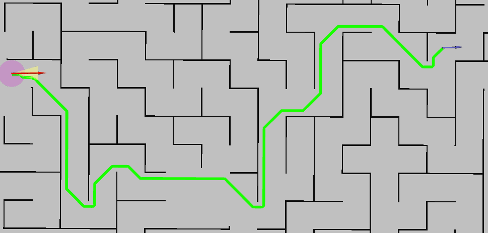
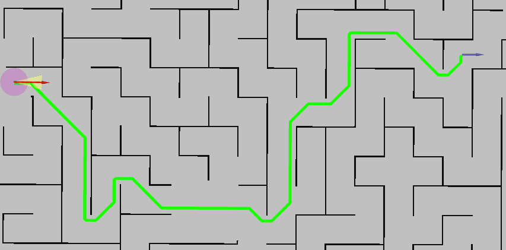
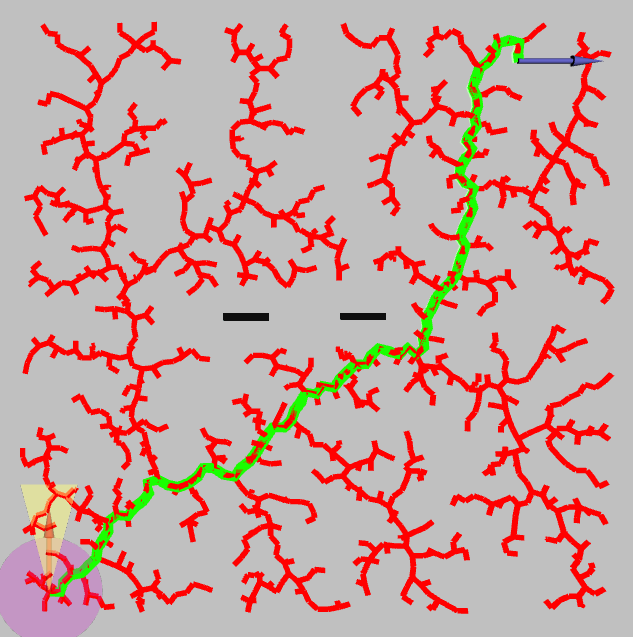

# Path-Planning
This repository implements ROS1 based Path Planning using some of the maze solver algorithm. 
Currently available with 3 different options of solver: 
### Djikstra Algorithm
<p align="center">
  
</p>

### A* Algorithm
<p align="center">
  
</p>

### RRT Algorithm
<p align="center">
  
</p>

## Installation
```bash
# navigate to your workspace directory
cd catkin_ws

# clone repo
git clone https://github.com/ardhimaulidani/Path-Planner.git src/
catkin_make

# install dependency
rosdep install --from-paths src/Path-Planner/package.xml -y
source devel/setup.bash
```

## Usage
Generate path using path planner algorithm.
Choose algorithm used by changing param in launch file
```bash
# Run Path Planner
roslaunch path_planner planner.py
```

Generate path using CSV Parser
```bash
# Edit Waypoint in "src/wp.csv"
rosrun path_planner waypoint.py
```

## References
* [Common Algorithm](https://github.com/zhm-real/PathPlanning) : Repository of some common path planning algorithms used in robotics
* [Python Robotics](https://github.com/AtsushiSakai/PythonRobotics) : Python sample codes for robotics algorithms
* [Algorithm Comparison](https://www.researchgate.net/publication/335188250_A_Comparison_of_A_and_RRT_Algorithms_with_Dynamic_and_Real_Time_Constraint_Scenarios_for_Mobile_Robots) : Journal of A* and RRT performance comparison
* [Improved A*](https://ieeexplore.ieee.org/document/7979125) : Journal of modified A* algorithm
